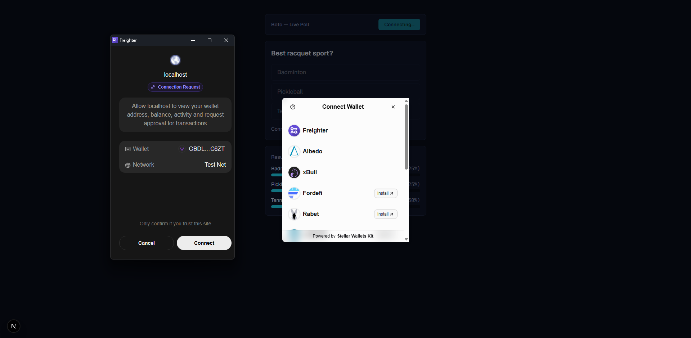
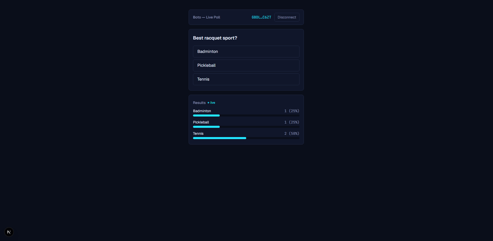
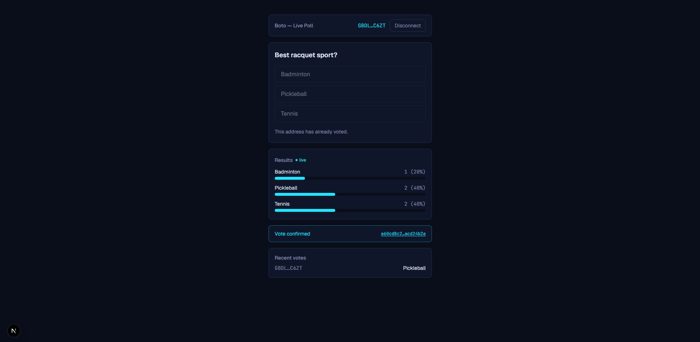

# Boto — Live Poll on Stellar

A one-question live poll dApp on Stellar Testnet. Connect any supported wallet, cast one vote on a Soroban smart contract, and watch results update in near-real-time as other votes land on-chain.

**Question:** "Best racquet sport?" — badminton, pickleball, or tennis. One vote per address, enforced on-chain.

Built for the Stellar Yellow Belt (Level 2) submission.

## Live demo

[boto-stellar.vercel.app](https://boto-stellar.vercel.app)

## Deployed contract

**Testnet contract address:**
```
CBLOGV3GZPY2JMMXBLBV536IVT2DBZ7SP5CMRI5EMHSICUWKM6SMGSCD
```

**Sample transaction (a `vote` call):**
[`a60cd8c2ec7bb76821f86ce92ef0e3681463d96e92a64a4b0fcaf187acd24b2a`](https://stellar.expert/explorer/testnet/tx/a60cd8c2ec7bb76821f86ce92ef0e3681463d96e92a64a4b0fcaf187acd24b2a)

## Screenshots

**Wallet options** — the StellarWalletsKit picker modal:



**Poll with live results:**



**TxStatus success with hash** — confirmed vote, updated results, and the recent-votes feed:



## Error types handled

| # | Error | User-facing message |
|---|---|---|
| 1 | Wallet not found / not installed | Wallet picker modal shows an install link for unavailable wallets |
| 2 | User rejected signing | "Transaction cancelled in wallet." |
| 3 | Contract error — `AlreadyVoted` | "This address has already voted." |
| 4 | Contract error — `InvalidOption` | "Invalid option selected." |
| 5 | Insufficient balance for fees (unfunded account) | "This wallet has no XLM yet — fund it with Friendbot first." |

## Architecture

The contract stores per-option vote counts as `Votes(u32) -> u64` in **instance storage** (small, bounded, cheap to read every load) and tracks who has voted as `HasVoted(Address) -> bool` in **persistent storage**, keyed per-address so it scales with the number of voters rather than the fixed option count. `vote()` panics via `#[contracterror]` codes (`InvalidOption`, `AlreadyVoted`) rather than returning `Result`, so the frontend parses the `Error(Contract, #N)` pattern out of failed simulations directly. Real-time results come from polling `rpc.Server.getEvents` every 5 seconds for the contract's `vote` topic, using the RPC's returned cursor (not ledger ranges) to page forward without double-counting; on any new event the frontend simply refetches `get_results` rather than reconstructing counts from event data, since testnet's limited event retention window means polling — not backfilling — has to be the source of truth from page load onward.

## Setup

### Prerequisites

- Node.js 22+, pnpm 11+
- Rust + `stellar-cli` (for contract development) — `rustup target add wasm32v1-none`

### Environment variables

`app/.env.local`:
```
NEXT_PUBLIC_POLL_CONTRACT_ID=CBLOGV3GZPY2JMMXBLBV536IVT2DBZ7SP5CMRI5EMHSICUWKM6SMGSCD
```

### Run the frontend

```bash
cd app
pnpm install
pnpm dev
```

Visit `http://localhost:3000`.

### Redeploy the contract

```bash
cd contracts/poll
cargo test

stellar contract build
stellar contract deploy \
  --wasm ../../target/wasm32v1-none/release/poll.wasm \
  --source deployer --network testnet
```

Update `NEXT_PUBLIC_POLL_CONTRACT_ID` in `app/.env.local` with the new contract ID.
